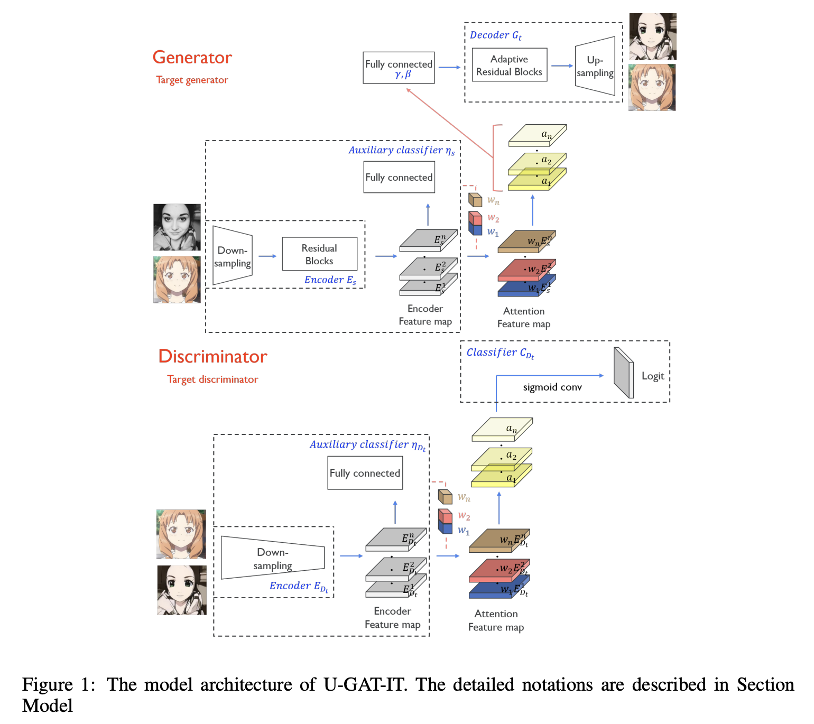
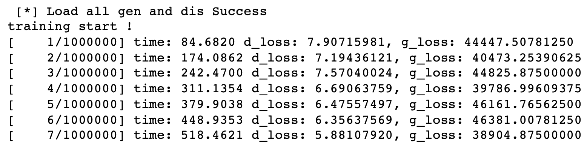

# 基于GAN的漫画脸生成（mindspore框架）

## 简介
图像风格迁移领域近期有一篇论文U-GAT-IT提出了一种归一化方法——AdaLIN，能够自动调节Instance Norm和Layer Norm的比重，再结合attention机制能够实现精美的人像日漫风格转换。

[U-GAT-IT](https://arxiv.org/pdf/1907.10830.pdf)是Clova AI Research的Junho Kim等人发表在ICLR2020上的一个基于GAN的风格迁移模型。整体框架图如图所示。




主要包含两个生成器Generator和四个辨别器Discriminator，也是本工作的主要完成训练框架转换的部分。本工作主要根据开源的pytorch代码，将其中的风格迁移模型U-GAT-IT的模型定义、训练和测试脚本改成了mindspore框架，而数据预处理的部分保留原先的pytorch框架。

## 生成过程

由于实验数据较为匮乏，为了降低训练难度，首先将数据处理成固定的模式。数据处理部分用的是pytorch的模型和框架。主要包含以下几个步骤：

- 检测人脸及关键点。
- 根据关键点旋转校正人脸。
- 将关键点边界框按固定的比例扩张并裁剪出人脸区域。
- 使用人像分割模型将背景置白，得到统一的图像模式。


最后将去除背景的正脸，输入U-GAT-IT模型中进行漫画风格迁移，得到最终的漫画脸。

<div align='center'>
  
</div>


## Start

### 硬件环境与依赖库

相关的系统与硬件配置如下：

- Linux x86_64
- Ubuntu 18.04
- NVIDIA Tesla T4 (CUDA 11.4)

项目所需的主要依赖库如下：

- mindspore 1.7.0

- python 3.7.5
- pytorch 1.7
- tensorflow-gpu 1.14
- face-alignment
- dlib


### 预训练模型与数据集下载

1. U-GAT-IT 预训练模型（由pytorch模型权重文件转换）[百度网盘](https://pan.baidu.com/s/1FvuCCwFunaNP_3gAaru4pg) 提取码：4ipf
2. 头像分割模型：seg_model_384.pb [百度网盘](https://pan.baidu.com/s/1wLgUwTIXYFTLjGqoXisjrA) 提取码：ems4
3. 人脸识别预训练模型：model_mobilefacenet.pth  [百度网盘](https://pan.baidu.com/s/1nsf-4GXt_Ol16rALlb8iww) 提取码：me5i

将下载的权重放到`./pretrained_models`路径下。

4. 训练和测试数据集下载 [百度网盘](https://pan.baidu.com/s/13yehDbGjuZ8p-ijNjEk9Cw) 提取码：n7vf

解压后，对其中的`./trainA-pre`和`testA-pre`中的图片使用以下命令进行预处理：

```shell
python data_process.py --data_path trainA-pre --save_path trainA

python data_process.py --data_path testA-pre --save_path testA
```

将处理后的数据按照以下层级存放，`trainA`、`testA`中存放照片头像数据，`trainB`、`testB`中存放卡通头像数据。

```
├── dataset
    └── photo2cartoon
        ├── trainA
            ├── xxx.jpg
            ├── yyy.png
            └── ...
        ├── trainB
            ├── zzz.jpg
            ├── www.png
            └── ...
        ├── testA
            ├── aaa.jpg 
            ├── bbb.png
            └── ...
        └── testB
            ├── ccc.jpg 
            ├── ddd.png
            └── ...
```

### 训练

1. 随机初始化权重并重新训练:

```shell
python train.py --dataset photo2cartoon
```

2. 加载预训练参数进行训练:

```shell
python train.py --dataset photo2cartoon --pretrained_model pretrained_models
```

3. 训练过程中会输出iteration和训练的时间、生成器的损失g_loss和辨别器的损失d_loss：

<div>
  
</div>


4. 按照pytorch源码中的设置，需要对模型进行约9w轮次的迭代训练，才能得到比较好的效果。


### 测试

1. 将一张测试照片（亚洲年轻女性）转换为卡通风格：

```shell
python test.py --photo_path ./images/photo_test.jpg --save_path ./images/cartoon_result.png
```

2. 测试输出如下，表示漫画脸生成成功，生成结果存放在`--save_path`设置的路径下。

<div>
  
</div>


### 参考

1. Junho Kim, Minjae Kim, Hyeonwoo Kang, and Kwang Hee Lee. "U-GAT-IT: Unsupervised Generative Attentional Networks with Adaptive Layer-Instance Normalization for Image-to-Image Translation." In International Conference on Learning Representations. 2019. [Paper](https://arxiv.org/abs/1907.10830)

2. [InsightFace_Pytorch](https://github.com/TreB1eN/InsightFace_Pytorch)

3. [mindspore](https://github.com/mindspore-ai/mindspore/tree/master)  

4. [mindspore 文档](https://mindspore.cn/docs/zh-CN/r1.7/index.html)

5. [minivision-ai/photo2cartoon](https://github.com/minivision-ai/photo2cartoon) 

6. [lvyufeng/MindSpore-GAN](https://github.com/lvyufeng/MindSpore-GAN/tree/master)

